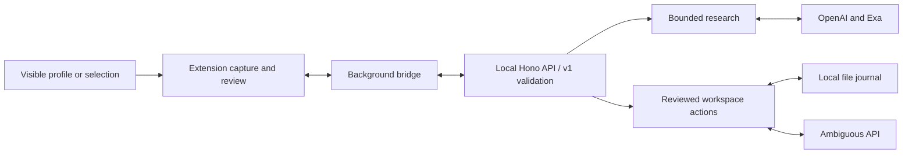

# AgentLayer engineering handoff

AgentLayer helps someone turn a professional profile into a reviewed contact and follow-up, or selected article text into a research note, without copying context between applications. David Král is the solo builder. The target is two specific browser workflows; universal website support remains a vision. Implementation and recorded live backend research exist; complete browser-to-workspace journeys remain unverified. This handoff separates inspected code, locally executed checks and recorded provider evidence. See [product concept](../../PROJECT-CONCEPT.md), [delivery plan](../../DELIVERY-PLAN.json), [README](../../../README.md) and [research evidence](../../../apps/api/tests/research/live-evidence/README.md).

## From page to reviewed action

The Chrome extension's activation path injects a React interface into a shadow root. The current design is a fixed right sidebar, up to 400 px wide and constrained to the viewport, superseding the earlier inline card. Native-toolbar operation still needs live acceptance. In the reviewed v1 workflow, `extractPageContext` prefers selected text, then a narrow LinkedIn personal-profile adapter, then the local fictional demo. `resolveActions` offers contact/follow-up for profiles and research-note preparation for selections. Unknown fields remain null; selection capture truncates at 10,000 characters and excludes editable regions. LinkedIn selectors are explicit heuristics requiring live validation. Sources: [activation](../../../apps/extension/entrypoints/background.ts), [mounting](../../../apps/extension/entrypoints/agent.content/index.tsx), [sidebar styles](../../../apps/extension/entrypoints/agent.content/style.css), [adapters](../../../apps/extension/adapters/index.ts), [LinkedIn](../../../apps/extension/adapters/linkedin.ts), [selection](../../../apps/extension/adapters/selection.ts).



The diagram shows configured code paths; the recorded research runs below cover only the research/provider portion. `createApiBridge` converts browser evidence into `PageContext`, validates responses and constructs commits from reviewed fields. The background worker accepts designated extension senders, attaches local pairing credentials and uses fixed routes on `http://127.0.0.1:4318`. Page input cannot supply a backend destination. `createApp` requires bearer authentication for `/api/*`, JSON for writes and a 65,536-byte body limit. `GET /ready` reports local readiness only. Sources: [bridge](../../../apps/extension/lib/api-bridge.ts), [background](../../../apps/extension/entrypoints/background.ts), [HTTP app](../../../apps/api/src/app.ts).

## Research and the public contract

The canonical [contracts entry point](../../../packages/contracts/src/index.ts) exports [v1 Zod schemas](../../../packages/contracts/src/v1.ts). `POST /api/research` accepts `ResearchRequestSchema` and returns a `ResearchResponseSchema` containing a cited brief and an editable proposal. `POST /api/actions/commit` accepts `CommitRequestSchema`; `GET /api/actions/:requestId` reconciles an existing request. Both save paths validate `CommitResultSchema`, including operation-level uncertainty. [IntegrationPorts](../../../apps/api/src/routes/actions.ts) separates research, commit and reconciliation.

`configuredIntegrations` constructs `createResearcher` only when model and research keys are present. The research loop uses OpenAI Responses with strict structured output and only `exa_search`; no workspace tool is exposed. Defaults bound the run to four searches, 60 seconds overall, 25 seconds per research HTTP request and 24,000 evidence characters. The loop permits query refinement but rejects extra tools and calls beyond budget. Failed provider requests are not automatically retried. Sources: [configuration](../../../apps/api/src/config/integrations.ts), [researcher](../../../apps/api/src/adapters/research.ts), [model](../../../apps/api/src/research/model.ts), [limits](../../../apps/api/src/research/types.ts), [HTTP transport](../../../apps/api/src/research/http.ts).

`buildBrief` requires referenced evidence and exact supporting quote substrings, discards unsupported claims, and derives summary text from surviving claims. Person claims additionally require corroborated identity; a name alone is insufficient. These checks constrain output but cannot establish semantic truth. The HTTP route now calls `prepareResearchDraft`, assigns a server proposal ID, validates the response and stores the proposal for later commit. This supersedes the earlier duplicated route builder. Sources: [evidence](../../../apps/api/src/research/evidence.ts), [routes](../../../apps/api/src/routes/actions.ts), [draft helper](../../../apps/api/src/research/drafts.ts).

This synthetic request/response example illustrates a schema-valid note commit that the server rejects because its proposal was never issued. It creates no provider-success claim and must not be used as a live-write recipe:

```http
POST /api/actions/commit
Content-Type: application/json
Authorization: Bearer <local-pairing-token>

{"requestId":"example-request","proposalId":"never-issued","contextId":"example-selection","actionKind":"research_note","reviewedPayload":{"actionKind":"research_note","note":{"title":"Review selected text","content":"Illustrative text only."}}}

HTTP/1.1 409 Conflict
Content-Type: application/json

{"code":"PROPOSAL_EXPIRED","message":"Research and review this context again.","retryable":false,"requestId":null,"operation":"commit"}
```

This is the expected authenticated route behavior, not a captured response. Source: [commit validation](../../../apps/api/src/routes/actions.ts).

## Stale context and write boundaries

`watchContext` observes relevant DOM changes, selections and navigation, with 300 ms polling for `pushState`. The card checks context before actions; a generation counter rejects stale completions. Context correction clears the proposal. Save snapshots the reviewed payload and retains its request ID for status checks and permitted retries. React renders returned text, while link helpers restrict actionable schemes. Sources: [lifecycle](../../../apps/extension/lib/context-lifecycle.ts), [card](../../../apps/extension/components/AgentCard.tsx), [URL helper](../../../apps/extension/lib/workflow.ts).

Cancellation suppresses stale UI results; the bridge does not relay that cancellation to an already dispatched background fetch. Navigation clears the card's saved request and displays its reference in a warning. Closing or reloading the card loses its in-memory recovery handle. A dispatched write may still finish. Sources: [bridge](../../../apps/extension/lib/api-bridge.ts), [card](../../../apps/extension/components/AgentCard.tsx), [background](../../../apps/extension/entrypoints/background.ts).

Server proposals reside in memory for 30 minutes. Commit checks proposal existence, context, action, mode, immutable profile URL and a nonempty contact name. Evidence is recovered from server storage, not accepted as client-provided source lists. These checks bind a proposal to captured context; they do not independently observe the current browser page. Sources: [routes](../../../apps/api/src/routes/actions.ts), [workspace v1 bridge](../../../apps/api/src/workspace/v1.ts).

`WorkspaceActions` maps a profile into a contact and linked task; a selection becomes a document with literal text nodes. Contact reuse matches normalized profile URLs, never name alone, and does not overwrite existing fields. New records require read-back verification before success. Task dates remain calendar `YYYY-MM-DD`. The adapter uses fixed Ambiguous contact/task/document paths; returned operation URLs remain null. Sources: [mapping](../../../apps/api/src/workspace/mapping.ts), [actions](../../../apps/api/src/workspace/index.ts), [provider](../../../apps/api/src/adapters/ambiguous.ts).

## Persistence and recovery

`FileJournal` stores hashes, expected fields, operation state and confirmed IDs under `apps/api/.agentlayer/<workspace-hash>/` when launched through npm workspace scripts. It fsyncs temporary files before rename and uses an exclusive `writer.lock` directory. An operation is persisted as unknown before dispatch. Same-ID changed payloads conflict; successful operations are skipped on retry. Only explicitly retryable failures can be retried; uncertain writes first require reconciliation. Sources: [configuration](../../../apps/api/src/config/integrations.ts), [journal](../../../apps/api/src/workspace/journal.ts), [actions](../../../apps/api/src/workspace/index.ts).

Reconciliation reads back known IDs. An unknown write without an ID stays unresolved: there is no provider search-by-request recovery. Journal state survives restart, but proposals do not, so a subsequent commit still fails without a valid proposal. A crash can leave the lock; operator recovery requires confirming no writer exists before removing only the empty lock directory. No cleanup was performed here. Sources: [journal](../../../apps/api/src/workspace/journal.ts), [routes](../../../apps/api/src/routes/actions.ts), [README recovery](../../../README.md#save-recovery).

## Reproduce locally

For a separate setup session, use Node 22.18+ and npm from the repository root. These installation/build/start commands were documented, not executed for this document task:

```powershell
npm install
npm run build
$env:AGENTLAYER_MODE = 'demo'
npm run dev:api
```

In another root terminal:

```powershell
Invoke-RestMethod http://127.0.0.1:4318/ready
npm run typecheck
npm test
node apps/extension/tests/background-tests.mjs
npx playwright install chromium
node apps/extension/tests/browser-tests.mjs
npm run test:e2e
```

Install Chromium before browser checks if absent. Load `apps/extension/.output/chrome-mv3` unpacked, pair through Options using the locally managed server token, and open `/demo`. Default demo research/writes fail closed. The e2e runner needs a running demo API, reads pairing material and writes a screenshot; it checks service-worker injection, not the native toolbar click. Sources: [scripts](../../../package.json), [API scripts](../../../apps/api/package.json), [startup](../../../apps/api/src/index.ts), [smoke runner](../../../tests/e2e/extension-smoke.mjs), [README](../../../README.md).

On Windows x64 only, if the README's inherited Linux npm override applies, replace installation with `npm install --os=win32 --cpu=x64`. Live setup requires `AGENTLAYER_MODE=live`, `OPENAI_API_KEY`, `OPENAI_MODEL`, `EXA_API_KEY`, `AMBIGUOUS_API_KEY` and `AMBIGUOUS_WORKSPACE_ID` on the server. Settings report presence, never verified connectivity. The workspace identifier scopes the local journal but is not sent to select the provider tenant. There is one configured key and workspace scope per server, without per-user workspace routing. Sources: [README](../../../README.md), [configuration](../../../apps/api/src/config/integrations.ts), [readiness](../../../apps/api/src/config/readiness.ts), [provider](../../../apps/api/src/adapters/ambiguous.ts).

## Evidence and remaining proof

**Checks executed for this document:** typechecking, six contract tests and the fixture background suite passed. This reviewer did not execute providers, browser journeys or write-producing suites. Round 2 inspected existing artifacts and validated their structure locally. See [REVIEW](REVIEW.md).

**Recorded live backend research:** the [evidence README](../../../apps/api/tests/research/live-evidence/README.md) records genuine OpenAI/Exa runs using `gpt-5.6-luna` and manually supplied contexts, not extension capture. The [broad-search report](../../../apps/api/tests/research/live-evidence/broad-search-report.json), captured September 12, 2026, contains Simon Willison (matched, 3 claims/4 sources, 13,147 ms), Andrej Karpathy (matched, 6/4, 8,319 ms), and a W3C selection (insufficient identity, 1/1, 4,389 ms). Selection identity is insufficient because there is no person to identify. Every accepted claim references its run's `s1`; source counts do not imply independent corroboration. Simon's warnings preserve discarded assessments.

The README records manual source review; this reviewer inspected that record without revisiting the public pages. [Draft validation](../../../apps/api/tests/research/live-evidence/draft-validation.json) records three validated drafts, each with `workspaceWrites: false`; their identifiers were local review identifiers, not server-issued commit authorization. This sample supports bounded research evidence, not universal quality or injection resistance.

**Additional API-path evidence:** a later [in-process authenticated API report](../../../tests/e2e/evidence/live-research-api.json) records two live-provider requests: profile HTTP 200 in 13,036 ms with ambiguous identity and zero accepted claims, and selection HTTP 200 in 7,021 ms with one claim. It explicitly records `browserTested: false` and zero workspace writes. HTTP success therefore must not be equated with useful findings or complete application success. This document inspected the saved report; it did not rerun the requests.

**Still missing:** native toolbar operation, real-page extraction and complete J1/J2 Save journeys with verified workspace records and links. C's handoff reports authenticated read-only workspace access, but that does not establish the requested Save behavior. The recorded backend runs and draft validation do not establish these gates. Sources: [evidence scope](../../../apps/api/tests/research/live-evidence/README.md), [integration handoff](../../handoffs/agent-d.md), [delivery plan](../../DELIVERY-PLAN.json).
